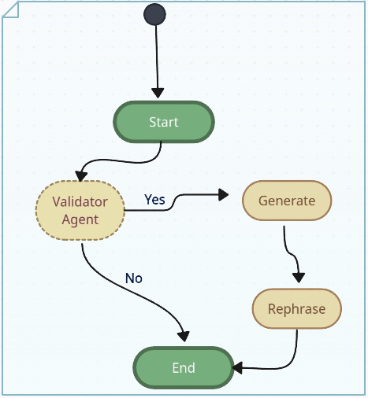

# Article Generator using Agents (starter template , feel free to customize)

This is an article generator by using Langgraph. Below is an image showing the graph flow.



## Customization of Agents

To customize the agents, follow these steps:

1. Download the repository.
2. Create a `.env` file and add your API key:
    ```plaintext
    OPENAI_API_KEY="your-key"
    ```
3. By editing the values in the `meta data` folder, you can easily customize the agents for your use case. Ensure you refer to the graph flow diagram for better understanding. You can further improve the system by comprehending the entire structure template.

4. Create a virtual environment and install the required packages:
    ```sh
    pip install -r requirements.txt
    ```
5. Run the script:
    ```sh
    python graph.py
    ```

### Meta Data Folder

The `meta data` folder contains a file named `initial_input.txt`, which holds the initial input for the Agent process.

The `meta` folder includes several subfolders, each representing an agent. For example, the folder structure might look like this:
```
meta data/
    generate/
        config.json
        human.txt
        system.txt
initial_input.txt
```

- `config.json`: Contains parameters such as `temperature`, `max_tokens`, and `model_name`.
- `system.txt`: Contains instructions for the agent.
- `human.txt`: Contains text that will be followed by the previous agent's output. If it is the first agent, it will contain text from `initial_input.txt`.

### Validator

This component filters out topics related to politics, war, or crime. You can edit the `validator` folder in the `meta data` directory to suit your needs.

By following these steps, you can customize and run the article generator to suit your specific needs.
